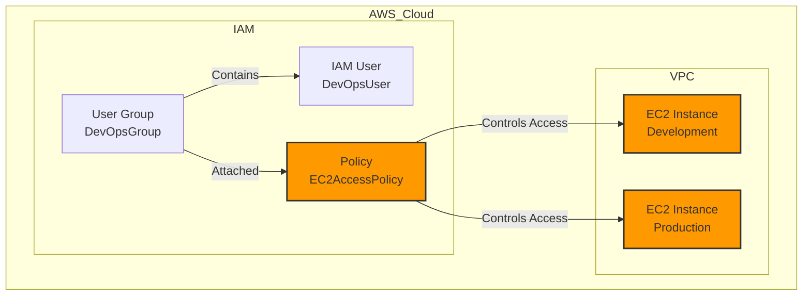

```mermaid
graph TD
    subgraph AWS_Cloud
        subgraph VPC
            EC2_Dev[EC2 Instance<br>Development]
            EC2_Prod[EC2 Instance<br>Production]
        end
        subgraph IAM
            UserGroup[User Group<br>DevOpsGroup]
            IAMUser[IAM User<br>DevOpsUser]
            IAMPolicy[Policy<br>EC2AccessPolicy]
            UserGroup -->|Contains| IAMUser
            UserGroup -->|Attached| IAMPolicy
        end
        IAMPolicy -->|Controls Access| EC2_Dev
        IAMPolicy -->|Controls Access| EC2_Prod
    end
    classDef aws fill:#FF9900,stroke:#333,stroke-width:2px;
    class EC2_Dev,EC2_Prod,IAMPolicy aws;
```
